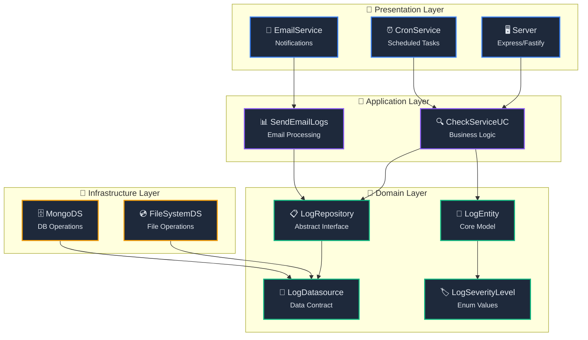

<div align="center">

# 🚀 NOC App - Network Operations Center

<p align="center">
  
  
  
  
</p>

<p align="center">
  <strong>Sistema de monitoreo de red moderno y escalable</strong><br>
  Supervisa la disponibilidad de servicios web con verificaciones programadas,<br>
  implementando Clean Architecture con logging avanzado y notificaciones inteligentes.
</p>

<p align="center">
  <a href="#-características">Características</a> •
  <a href="#-instalación">Instalación</a> •
  <a href="#-arquitectura">Arquitectura</a> •
  <a href="#-uso">Uso</a> •
  <a href="#-configuración">Configuración</a>
</p>

</div>

---

## ✨ Características Principales

<table>
<tr>
<td width="50%">

### 🎯 **Core Features**

- 🔍 **Monitoreo Inteligente** - Verificaciones automáticas con detección de anomalías
- � **Loggling Avanzado** - Sistema de logs con niveles de severidad y persistencia
- 🏗️ **Clean Architecture** - Separación clara de responsabilidades y capas
- ⚡ **TypeScript Estricto** - Desarrollo type-safe con las últimas características

</td>
<td width="50%">

### 🚀 **Advanced Features**

- 🔄 **Cron Jobs Flexibles** - Programación avanzada de tareas de monitoreo
- � **Persi]stencia Dual** - Almacenamiento en archivos y MongoDB
- � *C*Notificaciones Email\*\* - Alertas automáticas por correo electrónico
- � **Daocker Ready** - Containerización completa con Docker Compose

</td>
</tr>
</table>

## 🏗️ Arquitectura del Sistema

<div align="center">



</div>

### 📁 Estructura del Proyecto

```
src/
├── 🎯 domain/                 # Lógica de negocio
│   ├── entities/              # Entidades del dominio
│   ├── repository/            # Interfaces de repositorio
│   ├── datasources/           # Contratos de datos
│   └── use-cases/             # Casos de uso
│       ├── checks/            # Verificaciones de servicios
│       ├── email/             # Gestión de emails
│       └── logs/              # Manejo de logs
├── 🔧 infrastructure/         # Implementaciones técnicas
│   ├── datasources/           # Fuentes de datos
│   └── repository/            # Implementación de repositorios
├── 🎨 presentation/           # Capa de presentación
│   ├── cron/                  # Tareas programadas
│   ├── email/                 # Servicios de email
│   └── server.ts              # Servidor principal
├── ⚙️ config/                 # Configuraciones
│   └── plugins/               # Plugins de configuración
└── 💾 data/                   # Configuración de datos
    ├── mongo/                 # MongoDB setup
    └── postgres/              # PostgreSQL setup (futuro)
```

## 🚀 Instalación

### 📋 Prerrequisitos

<table>
<tr>
<td align="center" width="25%">
<br>
<strong>v18+</strong>
</td>
<td align="center" width="25%">
<br>
<strong>v6+</strong>
</td>
<td align="center" width="25%">
<br>
<strong>v5.9+</strong>
</td>
<td align="center" width="25%">
<br>
<strong>Opcional</strong>
</td>
</tr>
</table>

### ⚡ Instalación Rápida

```bash
# 1️⃣ Clonar repositorio
git clone https://github.com/tu-usuario/noc-app.git
cd noc-app

# 2️⃣ Instalar dependencias
npm install

# 3️⃣ Configurar variables de entorno
cp .env.example .env
# Editar .env con tus configuraciones

# 4️⃣ Iniciar con Docker (Recomendado)
docker-compose up -d

# 5️⃣ Ejecutar aplicación
npm run dev
```

### � Doclker Compose

```yaml
services:
  mongo:
    image: mongo:latest
    restart: always
    environment:
      MONGO_INITDB_ROOT_USERNAME: ${MONGO_USER}
      MONGO_INITDB_ROOT_PASSWORD: ${MONGO_PASS}
    ports:
      - "27017:27017"
    volumes:
      - ./mongo:/data/db

  noc-app:
    build: .
    ports:
      - "3000:3000"
    environment:
      - NODE_ENV=production
      - MONGO_URL=mongodb://mongo:27017
    depends_on:
      - mongo
    volumes:
      - ./logs:/app/logs
```

## ⚙️ Configuración

### 🔧 Variables de Entorno

```env
# MongoDB Configuration
MONGO_URL=mongodb://localhost:27017
MONGO_DB_NAME=noc_db
MONGO_USER=noc_user
MONGO_PASS=noc_password

# Email Configuration
MAILER_SERVICE=gmail
MAILER_EMAIL=your-email@gmail.com
MAILER_SECRET_KEY=your-app-password

# Application Settings
NODE_ENV=development
PORT=3000
LOG_LEVEL=info
```

### 📊 Niveles de Logging

<table>
<tr>
<td width="33%" align="center">

#### 🟢 **LOW**

Información general<br>
Operaciones normales<br>
Estado de servicios OK

</td>
<td width="33%" align="center">

#### 🟡 **MEDIUM**

Advertencias<br>
Latencia alta<br>
Timeouts ocasionales

</td>
<td width="33%" align="center">

#### 🔴 **HIGH**

Errores críticos<br>
Servicios caídos<br>
Fallos del sistema

</td>
</tr>
</table>

## � Uso

### 🚀 Inicio Básico

```typescript
import { Server } from "./presentation/server";
import { MongoDatabase } from "./data/mongo/init";
import { envs } from "./config/plugins/envs.plugin";

async function main() {
  // Conectar a MongoDB
  await MongoDatabase.connect({
    mongoUrl: envs.MONGO_URL,
    dbName: envs.MONGO_DB_NAME,
  });

  // Iniciar servidor
  Server.start();
}

main();
```

### 🔍 Monitoreo de Servicios

```typescript
import { CheckServiceUC } from "@domain/use-cases/checks/check-service";
import { CronService } from "@presentation/cron/cron-service";

// Configurar monitoreo cada 5 segundos
CronService.createJob("*/5 * * * * *", async () => {
  const checkService = new CheckServiceUC(
    logRepository,
    () => console.log("✅ Service OK"),
    (error) => console.log("❌ Service Error:", error)
  );

  await checkService.execute("https://www.google.com");
});
```

### 📧 Notificaciones por Email

```typescript
import { EmailService } from "@presentation/email/email.service";
import { SendEmailLogs } from "@domain/use-cases/email/send-email-logs";

const emailService = new EmailService();

// Enviar logs por email
const sendEmailLogs = new SendEmailLogs(emailService, logRepository);
await sendEmailLogs.execute("admin@empresa.com");

// Email personalizado
await emailService.sendEmail({
  to: "admin@empresa.com",
  subject: "🚨 Alert: Service Down",
  htmlBody: "<h1>Service monitoring alert</h1><p>Critical service is down!</p>",
});
```

## 📊 Sistema de Logging

### 🏷️ Estructura de Log

```typescript
interface LogEntity {
  level: LogSeverityLevel; // low | medium | high
  message: string; // Mensaje descriptivo
  origin: string; // Origen del log
  createdAt: Date; // Timestamp
}
```

### 💾 Persistencia Dual

<table>
<tr>
<td width="50%">

#### 📁 **File System**

- Logs almacenados en archivos
- Separación por nivel de severidad
- Rotación automática
- Acceso rápido para debugging

</td>
<td width="50%">

#### 🗄️ **MongoDB**

- Persistencia en base de datos
- Consultas avanzadas
- Escalabilidad horizontal
- Análisis de tendencias

</td>
</tr>
</table>

## 📈 Scripts Disponibles

| Comando         | Descripción                    | Uso              |
| --------------- | ------------------------------ | ---------------- |
| `npm run dev`   | 🔥 Desarrollo con hot-reload   | Desarrollo local |
| `npm run build` | 🏗️ Construir para producción   | Deploy           |
| `npm start`     | 🚀 Ejecutar versión construida | Producción       |

## 🔧 Tecnologías Utilizadas

<div align="center">

| Categoría      | Tecnologías                                                                                                                                                                                                             |
| -------------- | ----------------------------------------------------------------------------------------------------------------------------------------------------------------------------------------------------------------------- |
| **Runtime**    |    |
| **Database**   |          |
| **Email**      |                                                                                                          |
| **Scheduling** |                                                                                                                    |
| **DevOps**     |   |

</div>

## 🤝 Contribuir

1. Fork el proyecto
2. Crea tu rama de feature (`git checkout -b feature/AmazingFeature`)
3. Commit tus cambios (`git commit -m 'Add some AmazingFeature'`)
4. Push a la rama (`git push origin feature/AmazingFeature`)
5. Abre un Pull Request

## 📄 Licencia

Este proyecto está bajo la Licencia ISC. Ver el archivo `LICENSE` para más detalles.

---

<div align="center">

**Desarrollado con ❤️ usando Clean Architecture y TypeScript**

<p>
  <a href="#top">⬆️ Volver arriba</a>
</p>

</div>
